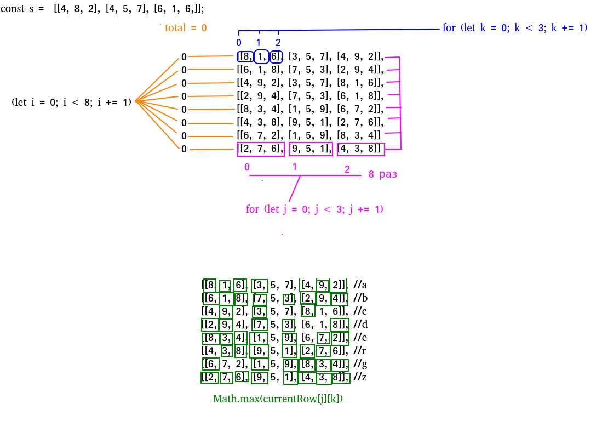

**Forming a Magic
Square**

**TASK:**

We define a magic square to be an _nxn_ matrix of distinct positive integers from _1_ to _n^2_ where the sum
of any row, column, or diagonal of length is always equal to the same number: _the magic constant_.

You will be given _3x3_ **s** a matrix of integers in the inclusive range **[1,9]**. We can convert any digit **a** to
any other digit **b** in the range **[1,9]** at cost of **|a-b|** . Given **s**, convert it into a magic square at _minimal_
cost. Print this cost on a new line.

Note: The resulting magic square must contain distinct integers in the inclusive range **[1,9]**.

_**Resolve:**_

`npm install` and run tests `npm test`

The search for the minimum value is carried out by a multidimensional array `PossibleCombinations`. It has every possible combination.

The first loop `for (let i = 0; i < 8; i += 1)` iterates over the array row by row. 8 possible combinations - 8 lines. Each iteration is assigned a string from the array.

The second loop `for (let j = 0; j < 3; j += 1)` iterates over arrays on a single line (0, 1, 2).

The third loop `for (let k = 0; k < 3; k += 1)` iterates over the elements in the child arrays(0, 1, 2).

A code block `if (s[j][k] !== currentRow[j][k])` is executed only if there are no numbers in `s[j][k]` and `currentRow[j][k])`.

`Math.max(s[j][k], currentRow[j][k])` Creates 2 matrices using loops. And shows the larger value of the two.
`Math.min(s[j][k], currentRow[j][k])` shows the lower of the two.

Total this is the sum of the matrices.
const s =  [[4, 8, 2], [4, 5, 7], [6, 1, 6,]];
total = 30, 36, **4**, 14, 26, 32, 14, 24
        
    //8 - 4 = 4
    //4 + 8 - 1 = 11
    //11 + 6 - 2 = 15
    //15 + 4 - 3 = 16
    //16 + 6 - 4 = 18
    //18 + 9 - 1 = 26
    //26 + 6 - 2 = 30
    
    //8 - 1 = 9
    //9 + 8 - 2 = 15
    //15 + 7 - 4 = 18
    //18 + 7 - 3 = 22
    //22 + 6 - 2 = 26
    //26 + 9 - 1 = 34
    //34 + 6 - 4 = 36
    
    //9 - 8 = 1
    //1 + 4 - 3 = 2
    //2 + 8 - 6 = 4
    
    //2 + 9 - 8 = 3
    //3 + 4 - 2 = 5
    //5 + 7 - 4 = 8
    //8 + 7 - 3 = 12
    //12 + 8 - 6 = 14
    
    //8 - 4 = 4
    //4 + 8 - 3 = 9
    //9 + 4 - 2 = 11
    //11 + 4 - 1 = 14
    //14 + 9 - 7 = 16
    //16+ 7 - 1 = 22
    //22 + 6 -2 = 26
    
    ..etc

# magic_square
